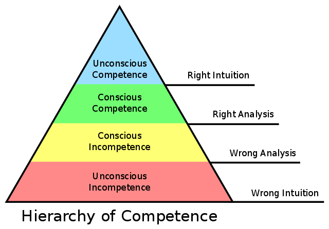

# Chapter five Perpetual Learning

책을 읽고 있는 사람 밑에 써 있는 글귀가 너무 좋아서 적어 본다.

> **If we let ourselves, we shall always be waiting for some distraction or other to end before we can really get down to our work. The only people who achieve much are those who want knowledge so badly that they seek it while the conditions are still unfavourable. Favourable conditions never come**

여건이 좋지 않을 떄에도 지식을 찾는다. 왜냐하면 여건이 좋을 때는 결코 오지 않기 때문이다.

너무 뼈저리게 느끼고 있다. 지금 아니면 못하기 때문이다. 해야 할게 있으면 지금 당장 시작해야 함의 중요성도 많이 느끼고 있다. 나중은 결코 오지 않는다.

농담 아니라 진짜로 나중에 밥 한번 먹자 얘기하고 나중에 같이 밥 먹어본 적이 단 한번도 없다!

## 논의할 내용

지속해서 공부해야 함의 중요성을 여러 패턴을 통해 얘기해 주고 있는데요, 자신만의 효과적이고 지속 가능한 공부 패턴이 뭔지 얘기해 보면 좋겠습니다. 

저는 1시간이 넘지 않을 분량을 짧게 잡고 내일 혹은 내일 모레, 적어도 1주일 이내에 할 계획을 세우고 실천하는 걸로 하고 공부하는 걸 지속하는 방법을 사용하고 있습니다. 지금 책 읽는 것도 이런 방식으로 진행하고 있고요. 확실히 작년, 올해 계속해서 스스로 수정 보완해 나가는 애자일 스크럼 방식의 스토리 만들고 실천하기 방법이 저한테 잘 맞는 것 같습니다.

## Expand Your Bandwidth

쉬운 일상적 업무를 빨대 꽃으면서 쉽게 일하고 있었다는 표현이 마음에 든다.

일 하는 것 외에 생각의 폭을 넓히는 활동을 하는 건 전적으로 동의하는 바이다. 커뮤니티 활동, 블로그 글 작성, 기술 토론 등은 반드시 코딩하는 활동이 아님에도 불구하고 능력의 폭을 넓혀주는 활동이기 때문이다.

## Practice, Practice, Practice

연습을 해야 하는 건 당연하지만, 코딩 도장이나 카타 같은 무술 수련에 빗대어 표현한다. 이미 함께 자라기에서도 확인한 내용이고 로버트 마틴의 책에서도 소개되는 내용이라 이제는 신선하게 다가오지는 않는 것 같다.

의견)  
연습을 하는 걸 업무중에 하지 말자는 얘기가 있는데 나의 생각은 조금 다르다. 짧게라도 연습할 시간이 주어질 수 있다면 해볼 수 있고 최선의 방법을 찾는 과정을 경험할 수 있다면 할 수 있다고 본다. 하지만 연습 자체가 회사 업무가 되는 것 까지는 아닌 것 같고, 실력을 쌓기 위해 연습하는 건 회사 업무 외에 활동을 하는 걸로 만들어 나가는게 좋다.

## Breakable Toys

일명 부수고 싶은 쓰레기 패턴. 그런데 사실 부수고 싶은 쓰레기라도 만들어 본 것과 안만들어 본 것의 차이는 크므로 흑역사로 남을 지언정 해보는게 좋다고 생각한다.

## Use the Source

상황에 아주 중요한 내용을 언급해 주고 있다.

> 프로그래머의 의도란, 코드가 그 의도를 제대로 반영하지 못한다면 공허한 것이 되어 버린다.

역으로 생각해 보면 코드에 프로그래머의 의도가 담겨 있고 읽을 수 있다는 뜻도 된다. 의외로 이걸 모르는 개발자들이 너무 많은 것 같다. 내 의도는 설명이 안되고 코드는 그냥 동작하는 걸 보여주는 것 뿐이라고 생각하고 코드 작성하는데 의미 부여를 안하는 사람들의 얘기이다.

해결책 첫 문장, 너무 마음에 든다.

> Seek out other people’s code and read it.

가끔 코드를 많이 작성하는게 실력 높이는 거라 생각하는 사람들 보면 이 얘기를 해주는데, 이걸 잘 이해를 못한다. 다른 사람 코드 보고 결국 내가 다시 짤 수 있어야 하는거 아니냐? 라고 반문하기도 하는데 코드 자체를 짤 수 있는 능력을 이해하라는게 아니라 그 코드에 담긴 의도를 파악하고 이해해서 이해한 내용이 내 코드에 나올 수 있느냐로 이해해야 한다고 본다.

책에도 코드를 많이 읽다 보면 시간이 지나면서 다른 사람이 작성한 코드에서 의도를 꿰뚫어 보는 능력을 키울 수 있다고도 언급을 하고 있다.

마지막으로 빌게이츠도 이런 부분을 언급하고 있다.

"one of the finest tests of programming ability is to hand the programmer about 30 pages of code and see how quickly he can read through and understand it."

여기에서 understand it은 절대 코드의 문법적 지식이 아님을 이해해야 한다.

## Reflect As You Work

내가 어떻게 일하고 있는지 성찰해야 한다는 내용. 회고와 비슷한 성격으로 보인다. 책에도 project retrospective라는 노엄 커스의 책을 소개하고 팀에서 회고의 방법에 대해 언급하고 있다.

조직에서 승진할수록 무능력해 진다는 피터의 법칙을 실제 경험해 본 바, 승진하면 멍청해진다기 보다는 실무에서 손을 떼고 관리를 하다 보면 책임질만 생기고 스스로 컨트롤하고 만들어 나가는 일을 하는데 시간을 많이 쓰기가 어려우므로 무능력해 진다고 본다.

## Record What You Learn

기록을 하는 것은 중요하다. 더 이상의 자세한 설명은 불필요.

## Share What You Learn

배운 것을 공유하는 활동을 하는 것 역시 중요하다. 기록으로 공유하는 패턴과 연관지을 수 있다.

저작권이나 관계를 악화 시키는 공유는 하지 않는 것이 좋다.

## Create Feedback Loops

제목과 달리 상당히 무서운 상황이 무엇인지를 얘기해 준다.
Unconscious incompetence(인식하지 못하는 무능력)인데 숙련되지 않은 사람일수록 무능력한지 어떤지에 대해 신경조차 쓰지 않는 상태라고 한다. 이런 상태가 과연 있을까??

그래서 이 문제를 해결하기 위해 피드백을 구체적으로 다양하게 받을 것을 권장한다. 유용한 피드백, 구체적인 피드백 등 그런 피드백을 받을 수 있는 상황을 만들어야 한다.

## Learn How You Fail

우선 실패에 대해 인지하는 것이 필요하다. 실패로 이끌어 가는 방식, 조건, 습관, 행동 양식이 무엇인지 인식해야 한다.

모든 걸 다 잘할 수 없으므로, 현실 적인 목표와 그 한계를 생각하게 된다. 그러면 잘 못하는 일을 더 잘 하려면 많은 시간과 노력을 투자해야 하는데 그걸 판단할 수 있게 된다.

실천 방안이 흥미로운데, IDE나 컴파일러의 도움 없이 텍스트 편집기로만 이진 탐색 알고리즘을 짜고 테스트 코드까지 짜면서 디버깅 버그 수정까지 계속 진행해야 하는 건데 한번 해볼만 하다 라는 생각도 든다. 여기서 발생하는 오류가 나의 실패 포인트고 그걸 개선해 나가는 과정에서 많은 걸 배울 수 있을 것 같긴 하다.

## Wrapping Up 

소프트웨어 장인정신과 전문적인 어떤 영역에 특화되는 길에 대한 설명이 나오는데, 이미 알고 있는 것에만 오로지 집중하는 것은 소프트웨어 장인정신이 아니라고 설명해 주고 있다.

다행히  
알고 있는 것에 집중하기 보다 새로운 것을 습득하는 걸 좋아하다 보니 소프트웨어 장인정신으로 향하는 길이 잘못되지 않았음을 다시 생각해 보게 된다.