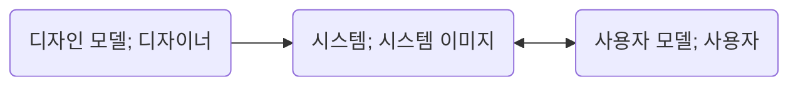

# 06 객체 지도

> 유일하게 변하지 않는 것은 모든 것이 변한다는 사실뿐이다. - 헤라클레이토스(Heraclitus of Ephesus)

- 다른 사람에게 길을 물어보는 방법은 '기능적이고 해결 지향적인 접근법(functional, solution-directed approach)'으로 일반적이지도, 재사용 가능하지 않다.

- 실세계의 지형을 기반으로 추상화된 모델인 지도를 이용한 방법은 '구조적이고 문제 지향적인 접근법(structural, problem-directed approach)'이다.

- 지도는 길을 찾는 데 필요한 구체적인 기능이 아니라 길을 찾을 수 있는 '구조'를 제공한다.

- 지도는 현재의 목적(한 마을에서 다른 마을로 이동)뿐만 아니라 다양한 목적을 위해 재사용될 수 있으므로 범용적이다.

- 지도가 범용적인 이유는 지도를 사용하려는 사람들이 원하는 '기능'에 비해 지도에 표시된 '구조'가 더 안정적이기 때문이다.

- 기능에 대한 요구사항이 계속 변함에도 지도는 이 모든 요구사항을 수용할 수 있는데, 지도는 기능에 비해 상대적으로 잘 변하지 않는 안정적인 지형 정보를 기반으로 하고 있기 때문이다.

- 지도 은유의 핵심은 기능이 아닌 구조를 기반으로 모델을 구축하는 편이 좀 더 범용적이고 이해하기 쉬우며 변경에 안정적이라는 것이다.

- 사람에게 직접 길을 묻는 접근법은 기능에 구조를 종속시키는 방법이며 지도는 구조에 기능을 종속시키는 방법이다.

- 객체지향은 자주 변경되는 기능이 아니라 안정적인 구조를 기반으로 시스템을 구조화한다.

- 자주 변경되는 기능이 아니라 안정적인 구조를 따라 역할, 책임, 협력을 구성하라.

## 기능 설계 대 구조 설계

- 기능(function) 측면의 설계는 제품이 사용자를 위해 무엇을 할 수 있는지에 초점을 맞춘다.

- 구조(structire) 측면의 설계는 제품의 형태가 어떠해야 하는지에 초점을 맞춘다.

- 설계의 가장 큰 도전은 기능과 구조라는 두 가지 측면을 함께 녹여 조화를 이루도록 만드는 것이다.

- 소프트웨어가 사용자에게 가치 있는 이유는 사용자가 필요로 하는 기능을 제공하기 때문이다.

- 소프트웨어를 개발하는 초기 단계에서는 사용자가 무엇을 원하는지, 그리고 사용자가 원하는 것을 만족시키기 위해 시스템이 어떤 기능을 제공해야 하는지에 초점을 맞춰야 한다.

- 훌륭한 기능이 훌륭한 소프트웨어를 만드는 충분조건이라고 한다면 훌륭한 구조는 훌륭한 소프트웨어를 만들기 위한 필요조건이다.

- 설계라는 행위를 중요하게 만드는 것은 변경에 대한 필요성이다.

- 미래에 대비하는 가장 좋은 방법은 변경을 예측하는 것이 아니라 변경을 수용할 수 있는 선택의 여지를 설계에 마련해 놓는 것이다.

- 좋은 설계는 나중에라도 변경할 수 있는 여지를 남겨 놓는 설계다.

- 설계를 하는 목적은 나중에 설계하는 것을 허용하는 것이며, 설계의 일차적인 목표는 변경에 소요되는 비용을 낮추는 것이다.

- 변경에 대비하고 변경의 여지를 남겨 놓는 가장 좋은 방법은 자주 변경되는 기능이 아닌 안정적인 구조를 중심으로 설계하는 것이다.

- 객체지향은 객체의 구조에 집중하고 기능이 객체의 구조를 따르게 만든다.

- 시스템 기능은 더 작은 책임으로 분할되고 적절한 객체에게 분배되기 때문에 기능이 변경되더라도 객체 간의 구조는 그대로 유지된다.

- 안정적인 객체 구조는 변경을 수용할 수 있는 유연한 소프트웨어를 만들 수 있는 기반을 제공한다.

- 객체 지도는 빠르게 변화하는 기능을 수용할 수 있는 자리를 제공, 즉 안정적이며 재사용 가능하면서도 범용적이다.

- 기능은 지도에 표시된 길을 따라 자연스럽게 흘러갈 것이다.

## 두 가지 재료: 기능과 구조

- 기능은 사용자가 자신의 목표를 달성하기 위해 사용할 수 있는 시스템의 서비스다.

- 구조는 시스템의 기능을 구현하기 위한 기반으로, 기능 변경을 수용할 수 있도록 안정적이어야 한다.

- 기능과 구조를 표현하기 위해 일관되게 적용할 수 있는 두 가지 기법이 있다.

  - 구조는 사용자나 이해관계자들이 도메인(domain)에 관해 생각하는 개념과 개념들 간의 관계로 표현한다.

  - 기능은 사용자의 목표를 만족시키기 위해 책임을 수행하는 시스템의 행위로 표현한다.

- 기능을 수집하고 표현하기 위한 기법을 유스케이스 모델링, 구조를 수집하고 표현하기 위한 기법을 도메인 모델링이라고 한다.

- 두 가지 모델링 활동의 결과물을 각각 유스케이스와 도메인 모델이라고 한다.

## 안정적인 재료: 구조

### 도메인 모델

- 사용자가 프로그램을 사용하는 대상 분야를 도메인이라고 한다.

- 모델이란 대상을 추상화하고 단순화한 것, 즉 복잡성을 관리하기 위해 사용하는 기본적인 도구다.

- 도메인 모델이란 사용자가 프로그램을 사용하는 대상 영역에 관한 지식을 선택적으로 단순화하고 의식적으로 구조화한 형태로 이해관계자들이 바라보는 멘탈 모델(Mental Model)이다.

- 멘탈 모델이란 사람들이 자기 자신, 다른 사람, 환경, 자신이 상호작용하는 사물들에 대해 갖는 모형이다.

- 소프트웨어 사용자들 역시 도메인에 존재하는 현상을 이해하고 현상에 반응하기 위해 도메인과 관련된 멘탈 모델을 형성한다.

- 설계자는 디자인 모델을 기반으로 만든 시스템 이미지가 사용자 모델을 정확하게 반영하도록 노력해야 한다.

- 도메인 모델은 도메인에 대한 사용자 모델, 디자인 모델, 시스템 이미지를 포괄하도록 추상화한 소프트웨어 모델, 즉 소프트웨어에 대한 멘탈 모델이다.

### 도메인의 모습을 담을 수 있는 객체지향

- 애플리케이션은 도메인 모델을 기반으로 설계돼야 한다.

- 객체지향을 이용하면 도메인에 대한 사용자 모델, 디자인 모델, 시스템 이미지 모두가 유사한 모습을 유지하도록 만드는 것이 가능하다: 연결완전성, 표현적 차이.

### 표현적 차이

- 소프트웨어 객체는 현실 객체를 모방한 것이 아니라 은유를 기반으로 재창조한 것이다: 표현적 차이, 의미적 차이.

- 핵심은 은유를 통해 현실 객체와 소프트웨어 객체 사이의 차이를 최대한 줄이는 것이다.

- 소프트웨어 객체를 창조하기 위해 우리가 은유해야 하는 대상은 바로 도메인 모델이다.

- 도메인 모델을 기반으로 설계하고 구현하는 것은 사용자가 도메인을 바라보는 관점을 그대로 코드에 반영할 수 있게 한다.

- 표현적 차이가 중요한 이유는 소프트웨어를 이해하고 수정하기 쉽게 만들어주기 때문이다.

- 코드의 구조가 도메인의 구조를 반영하기 때문에 도메인을 이해하면 코드를 이해하기 훨씬 수월해진다.

- 도메인 모델은 코드 안에 존재하는 미로를 헤쳐나갈 수 있는 지도를 제공한다.

### 불안정한 기능을 담는 안정적인 도메인 모델

- 사용자들은 도메인을 구성하는 중요한 개념과 개념 간의 관계를 가장 잘 알고 있는 사람들이다.

- 본질적이라는 것은 변경이 적고 비교적 그 특성이 오랜 시간 유지된다는 것을 의미한다.

- 안정적인 구조를 제공하는 도메인 모델을 기반으로 소프트웨어의 구조를 설계하면 변경에 유연하게 대응할 수 있는 탄력적인 소프트웨어를 만들 수 있다.

## 불안정한 재료: 기능

### 유스케이스

- 기능적 요구사항이란 시스템이 사용자에게 제공해야 하는 기능의 목록을 정리한 것이다.

- 훌륭한 기능적 요구사항을 얻기 위해서는 목표를 가진 사용자와 사용자의 목표를 만족시키기 위해 일련의 절차를 수행하는 시스템 간의 '상호작용' 관점에서 시스템을 바라봐야 한다.

- 사용자의 목표를 달성하기 위해 사용자와 시스템과의 상호작용의 흐름을 텍스트로 정리한 것을 유스케이스라고 한다.

- 유스케이스는 시스템의 이해관계자들 간의 계약을 행위 중심으로 파악한다.

- 유스케이스는 서로 다른 시나리오들을 묶어준다.

- 일차 액터(primary actor)란 시스템의 서비스 중 하나를 요청하는 이해관계자로 하나의 목표를 가지고 유스케이스를 시작하는 액터를 의미, 일반적으로 시스템과 연동하는 외부 시스템 역시 일차 액터의 범주에 포함시킨다.

- 유스케이스는 사용자들의 목표를 중심으로 시스템의 기능적인 요구사항들을 이야기 형식으로 묶을 수 있다, 즉 요구사항을 기억하고 관리하는 데 필요한 다양한 정신적 과부하를 줄일 수 있다.

> 사용자 목표가 유스케이스의 핵심이다. 유스케이스는 공통의 사용자 목표를 통해 강하게 연관된 시나리오의 집합이다. - 마팀 파울러(Martin Fowler)

### 유스케이스의 특성

- 유스케이스는 사용자와 시스템 간의 상호작용을 보여주는 '텍스트'다.

- 유스케이스는 하나의 시나리오(scenario)가 아니라 여러 시나리오들의 집합, 즉 유스케이스 인스턴스(use case instance)의 집합이다.

- 유스케이스는 단순한 피처(feature) 목록과 다르다.

- 유스케이스는 사용자 인터페이스와 관련된 세부 정보를 포함하지 말아야 한다: 본질적인 유스케이스(essential use case)

- 유스케이스는 내부 설계와 관련된 정보를 포함하지 않는다.

### 유스케이스는 설계 기법도, 객체지향 기법도 아니다

- 유스케이스에는 단지 사용자가 시스템을 통해 무엇을 얻을 수 있고 어떻게 상호작용할 수 있느냐에 관한 정보만 기술된다.

- 유스케이스는 단지 기능적 요구사항을 사용자의 목표라는 문맥을 중심으로 묶기 위한 정리 기법이다.

- 유스케이스로부터 시스템의 내부 구조를 유추할 수 있는 방법은 존재하지 않는다, 즉 객체의 구조나 책임에 대한 어떤 정보도 제공하지 않는다.

## 재료 합치기: 기능과 구조의 통합

### 도메인 모델, 유스케이스, 그리고 책임-주도 설계

- 불안정한 기능을 안정적인 구조 안에 담음으로써 변경에 대한 파급효과를 최소화하는 것은 훌륭한 객체지향 설계자가 갖춰야 할 기본적인 설계 능력이다.

- 변경에 유연한 소프트웨어를 만들기 위해서는 유스케이스에 정리된 시스템의 기능을 도메인 모델을 기반으로 한 객체들의 책임으로 분배해야 한다.

- 사용자의 관점에서 시스템은 자신이 전송한 메시지에 응답하는 데 필요한 책임을 수행하는 일종의 객체다.

- 협력의 출발을 장식하는 첫 번째 메시지는 시스템의 기능을 시스템의 책임으로 바꾼 후 얻어지는 것이다.

- 도메인 모델에 포함된 개념을 은유하는 소프트웨어 객체를 선택하는 것은 소프트웨어와 코드 사이의 표현적 차이를 줄이는 시작이다.

> 요구사항을 식별하고 도메인 모델을 생성한 후, 소프트웨어 클래스에 메서드들을 추가하고, 요구사항을 충족시키기 위해 객체들 간의 메시지 전송을 정의하라.

- 견고한 객체지향 애플리케이션을 개발하기 위해서는 사용자의 관점에서 시스템의 기능을 명시하고, 사용자와 설계자가 공유하는 안정적인 구조를 기반으로 기능을 책임으로 변환하는 체계적인 절차를 따라야 한다는 것이다.

- 유스케이스에서 출발해 객체들의 협력으로 이어지는 일련의 흐름은 객체 안에 다른 객체를 포함하는 재귀적 합성이라는 객체지향의 기본 개념을 잘 보여준다.

> ... 재귀적 설계의 기본 원칙은 부분이 전체와 동일한 힘을 갖게 만드는 것이다. ... - 앨런 케이

### 기능 변경을 흡수하는 안정적인 구조

- 도메인 모델을 구성하는 개념은 비즈니스가 없어지거나 완전히 개편되지 않는 한 안정적으로 유지된다.

- 도메인 모델을 구성하는 개념 간의 관계는 비즈니스 규칙을 기반으로 하기 때문에 비즈니스 정책이 크게 변경되지 않는 한 안정적으로 유지된다.

- 변경에 대한 파급효과를 최소화하고 요구사항 변경에 유연하게 대응할 수 있는 시스템을 구축할 수 있게 한다.

- 객체지향은 연결완전성의 역방향 역시 성립한다 즉 코드의 변경으로부터 도메인 모델의 변경 사항을 유추할 수 있다: 가역성(reversibility)

- 사람들이 동일한 용어와 동일한 개념을 이용해 의사소통하고 코드로부터 도메인 모델을 유추할 수 있게 하는 것이 도메인 모델의 진정한 목표다.

- 안정적인 도메인 모델을 기반으로 시스템의 기능을 구현하고 도메인 모델과 코드를 밀접하게 연관시키기 위해 노력하라.
