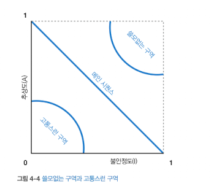

## Chapter 04: 아키텍처 분해

### 개요

- 컴포넌트 기반 분해
  - 어플리케이션의 논리적 구성 요소 단위 (컴포넌트 단위) 를 추출하고 이를 이용하여 아키텍처를 구성
  - 코드베이스가 컴포넌트 단위로 구성되어 있어 분해 가능할 경우 이쪽 선택
- 전술적 분기
  - 애플리케이션 사본을 복사하고 필요없는 부분을 깎아내며 구성
  - 코드베이스 분해 불가능할 경우 (엉망일 경우) 이쪽이 적절한 선택
- 도구를 이용하여 코드베이스의 특성을 파악하고 구조를 판별

### 추상도와 불안정도

- 코드베이스의 균형을 나타내는 척도
- 추상도
  - 구현 대비 추상화가 이뤄진 정도
  - 추상 요소와 구상 요소의 개수로 측정한다
- 불안정도
  - 코드베이스가 불안정한 정도
  - 커플링 (구심, 원심) 이 높을 경우 불안정도가 올라감
  - 컴포넌트끼리 강하게 엮여 있어 하나를 수정하면 다른 컴포넌트에 영향을 미칠 확률이 높다는 뜻



- 메인 시퀀스로부터의 거리
  - 추상도와 불안정도 사이의 이상적인 관계
  - x절편, y절편, 기울기 1의 직선
  - 이 선에 가까울수록 이상적이다 (컴포넌트 균형이 적절하다)
- 메인 시퀀스로부터의 거리 그래프 기준으로
  - 오른쪽 위로 치우친 부분은 추상화가 과도한 (쓸모없는) 구역
    - 사용이 어려움
  - 왼쪽 아래로 치우친 부분은 추상화가 없다시피한 (고통스러운) 구역
    - 취약하고 관리가 어려움

```
논의점: 추상도, 불안정도, 거리 등의 요소가 굉장히 수학적인 요소로 보이는데, 개발에는 정답이 없듯이 컴포넌트가 추상적인지, 불안정한지 여부를 판가름하는 기준도 매우 모호할 듯하다. 추상 클래스 등 명확하게 추상적인 요소가 없는 경우 이러한 수치들을 계산하고, 아키텍처 구성에 참고할 만한 자료로 삼는 것이 과연 가능할까 의문이 든다.
```

### 컴포넌트 기반 분해

- 컴포넌트 단위의 폴더구조 및 파일로 디렉터리를 구성 및 각 코드 분리
- 모놀리식을 분산 아키텍처로 마이그레이션할 때 도움이 된다

### 전술적 분기

- 진흙잡탕 아키텍처를 다듬을 때, 추출보다는 필요없는 것을 떼어내는 것에 중점
- 서로간의 의존성 때문에 추출에 한계가 있는 경우
- A팀, B팀이 서로 각각 코드베이스 사본을 복사한 후, 각자의 팀에 필요한 코드만 남기고 나머지를 삭제하는 기법
  - 이렇게 하면 각 파트별 큰 구조는 유지하면서 모놀리식 구조를 덩어리로 쪼갤 수 있다
- 분해보다 상대적으로 쉽지만 모놀리스 코드의 흔적이 계속 남아있을 가능성이 있다
- 개발자가 노력을 기울이지 않으면, 조금 더 가벼워졌을 뿐인 (코드 용량만 줄어든) 진흙덩어리가 될 수도 있음

```
느낀점?: 마침 아주 최근에 큰 덩어리의 진흙 코드를 서비스별로 분기하는 작업을 진행했는데, 그 과정에서 덩어리를 서비스별로 복사하고 그중 필요없는 코드를 지우고 공통화할 수 있는 코드만 분리하여 덩어리를 경량화한 적이 있었음. 전술적 분기 파트를 읽으면서 해당 작업 생각이 났다. (내가 진행한 작업이 어찌보면 전술적 분기구나? 하는)

난이도는 확실히 처음부터 작정하고 분리를 시도하는 것보다 간단한 편이고 시간도 많이 걸리지 않았지만, 덩어리 A를 분리하고 나서 덩어리 B를 작업하는 도중에 덩어리 A에 미처 덜어내지 못한 찌꺼기를 발견하는 등 코드 깎아내기에 어느 정도 익숙하지 않으면 실수하기가 쉬운 듯 하다. A 덩어리는 C, D, E 서비스를 분기할 때까지도 찌꺼기와 공통화가 덜된 요소들이 계속 발견되어 추가작업을 진행해야 했다.. 눈물..
```
