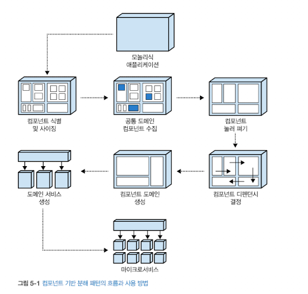

## Chapter 05: 컴포넌트 기반 분해 패턴

### 개요

1. 컴포넌트 식별 및 사이징
  - 나눌 컴포넌트의 크기를 결정
2. 공통 도메인을 갖는 컴포넌트 수집
  - 중복 가능성이 있는 로직 통합
3. 컴포넌트 눌러펴기
  - 도메인, 서브도메인, 컴포넌트를 정리
4. 컴포넌트 디펜던시 결정
  - 디펜던시를 다듬어 마이그레이션 실현가능성 및 작업량 결정
5. 컴포넌트 도메인 생성
  - 컴포넌트를 애플리케이션 내부의 논리적 도메인들로 그룹핑 및 리팩터링
6. 도메인 서비스 생성
  - 모놀리식 애플리케이션의 논리 도메인을 개별 배포된 도메인 서비스들로 이동
  - 모놀리식을 서비스 단위로 쪼개기

### 컴포넌트 식별 및 사이징

- 애플리케이션을 구성하는 컴포넌트를 식별하여 크기를 조절
- 너무 크거나 너무 작은 컴포넌트를 찾아내는 작업
  - 큰 컴포넌트의 경우 다른 컴포넌트들과의 결합도가 높을 가능성이 높다
- 컴포넌트 크기를 결정하는 지표
  - 문장 수 (조건문, 분기문 등, 세미콜론으로 구분)
  - 파일 수
  - 이러한 수치들을 이용하여 컴포넌트의 비중 계산
  - 컴포넌트 사이즈를 일정하게 유지하기 위해 피트니스 함수나 툴을 쓰면 좋다
    - 어떤 컴포넌트가 추가되고 삭제되었는지 알려주는 툴
    - 코드베이스에서 차지하는 비중을 나타내고 임계치를 벗어나지 않게끔 돕는 툴
    - 컴포넌트가 코드베이스 컴포넌트들의 크기 평균치보다 크지 않게 알려주는 툴
    - etc

- 사이즈는 애플리케이션 전반적으로 일정한 크기 유지가 필요함
- 컴포넌트 식별하기
  - 컨벤션을 유지한 적절한 이름
  - 네임스페이스 (컴포넌트가 위치한 디렉터리 또는 패키지 등)
  - 컴포넌트 비중 > 문장 수, 파일 수

- 예시에서 성한은 리포팅 컴포넌트의 비중이 지나치게 크다는 것을 발견하여 이를 적절한 세부 단위로 쪼개는 것으로 컴포넌트 크기를 고르게 만들었음

### 공통 도메인을 갖는 컴포넌트 수집

- 공통 도메인 로직을 발굴하여 단일 컴포넌트로 중앙화하는 패턴
- 여러 서비스에서 같이 사용되는 기능을 통합해 두면, 추후 중복 서비스를 쉽게 제거할 수 있다
- 이름이나 네임스페이스를 이용하여 구분
- 공통 도메인 로직 통합 전후의 커플링 (결합도) 을 계산하면 컴포넌트의 비중 및 통합 필요성 여부 판단에 도움이 된다

### 컴포넌트 눌러펴기

- A 컴포넌트가 B 컴포넌트를 기반으로 생성되고, B 컴포넌트가 C 컴포넌트를 기반으로 생성되는 등
  - 예시: 설문 컴포넌트를 기반으로 설문 템플릿을 작성할 경우
  -
- 디렉터리 상에 리프 노드만 존재하게끔 평평하게 누르는 작업
-
