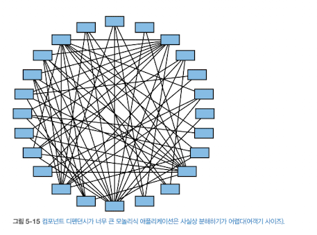

## Chapter 05: 컴포넌트 기반 분해 패턴

### 개요

1. 컴포넌트 식별 및 사이징
  - 나눌 컴포넌트의 크기를 결정
2. 공통 도메인을 갖는 컴포넌트 수집
  - 중복 가능성이 있는 로직 통합
3. 컴포넌트 눌러펴기
  - 도메인, 서브도메인, 컴포넌트를 정리
4. 컴포넌트 디펜던시 결정
  - 디펜던시를 다듬어 마이그레이션 실현가능성 및 작업량 결정
5. 컴포넌트 도메인 생성
  - 컴포넌트를 애플리케이션 내부의 논리적 도메인들로 그룹핑 및 리팩터링
6. 도메인 서비스 생성
  - 모놀리식 애플리케이션의 논리 도메인을 개별 배포된 도메인 서비스들로 이동
  - 모놀리식을 서비스 단위로 쪼개기

### 컴포넌트 식별 및 사이징

- 애플리케이션을 구성하는 컴포넌트를 식별하여 크기를 조절
- 너무 크거나 너무 작은 컴포넌트를 찾아내는 작업
  - 큰 컴포넌트의 경우 다른 컴포넌트들과의 결합도가 높을 가능성이 높다
- 컴포넌트 크기를 결정하는 지표
  - 문장 수 (조건문, 분기문 등, 세미콜론으로 구분)
  - 파일 수
  - 이러한 수치들을 이용하여 컴포넌트의 비중 계산
  - 컴포넌트 사이즈를 일정하게 유지하기 위해 피트니스 함수나 툴을 쓰면 좋다
    - 어떤 컴포넌트가 추가되고 삭제되었는지 알려주는 툴
    - 코드베이스에서 차지하는 비중을 나타내고 임계치를 벗어나지 않게끔 돕는 툴
    - 컴포넌트가 코드베이스 컴포넌트들의 크기 평균치보다 크지 않게 알려주는 툴
    - etc

- 사이즈는 애플리케이션 전반적으로 일정한 크기 유지가 필요함
- 컴포넌트 식별하기
  - 컨벤션을 유지한 적절한 이름
  - 네임스페이스 (컴포넌트가 위치한 디렉터리 또는 패키지 등)
  - 컴포넌트 비중 > 문장 수, 파일 수

- 예시에서 성한은 리포팅 컴포넌트의 비중이 지나치게 크다는 것을 발견하여 이를 적절한 세부 단위로 쪼개는 것으로 컴포넌트 크기를 고르게 만들었음

### 공통 도메인을 갖는 컴포넌트 수집

- 공통 도메인 로직을 발굴하여 단일 컴포넌트로 중앙화하는 패턴
- 여러 서비스에서 같이 사용되는 기능을 통합해 두면, 추후 중복 서비스를 쉽게 제거할 수 있다
- 이름이나 네임스페이스를 이용하여 구분
- 공통 도메인 로직 통합 전후의 커플링 (결합도) 을 계산하면 컴포넌트의 비중 및 통합 필요성 여부 판단에 도움이 된다

### 컴포넌트 눌러펴기

- A 컴포넌트가 B 컴포넌트를 기반으로 생성되고, B 컴포넌트가 C 컴포넌트를 기반으로 생성되는 등
  - 예시: 설문 (ss.survey) 하위에 설문 템플릿 (ss.survey.templates) 이 존재하는 경우
  - 설문 (ss.survey) 클래스와 직접적으로 연관된 컴포넌트는 없음
  - ss.survey.templates 컴포넌트를 ss.survey 로 옮겨 합치거나, ss.survey 기능을 분해하여 ss.survey.create, ss.survey.process 등으로 확장하여 루트 네임스페이스로 만드는 방법이 있다
    - 이때 ss.survey의 공통 클래스는 고아 클래스이므로, ss.survey 하위에 있는 컴포넌트들이 가져다 쓰는 ss.survey.template 를 추가하면 된다

- 디렉터리 상에 리프 노드만 존재하게끔 평평하게 누르는 작업
- 고아 클래스를 없애는 작업
  - 고아 클래스: 어떠한 컴포넌트와도 연관되지 않은, 루트 네임스페이스에 속하는 클래스

### 컴포넌트 디펜던시 결정

- 컴포넌트 간의 커플링 (데이터가 오가는 구간) 을 분석하여, 디펜던시가 어떤 양상을 보이는지 결정하는 패턴
- 모놀리식 어플리케이션을 분해했을 때 각 서비스간 어떠한 연관 (의존성) 을 가질지 분석하는 과정
- 위 이미지의 경우, 컴포넌트 간의 디펜던시가 너무 커서 사실상 컴포넌트 분해가 어렵고, 다시 코딩하는게 나은 수준
- 미리 컴포넌트 간의 결합도를 파악하는 것은 각 디펜던시를 리팩터링하고 서비스 단위로 분해하는 데에 큰 도움을 준다
- 피트니스 함수로는 디펜던시 개수에 제한을 두거나 특정 컴포넌트간 디펜던시를 갖지 않게 막을 수 있다

### 컴포넌트 도메인 생성

- 서로 관련된 기능들을 수행하는 컴포넌트들을 그룹핑하여 도메인을 식별하는 것은 결국 서비스 기반 아키텍처에서 각 서비스의 대상을 결정하는 과정이다
- 네임스페이스 노드로 도메인을 표현하면 좋다
- 예를 들어, 과금 관련 컴포넌트와 고객 프로필 관련 컴포넌트를 `고객` 이라는 더 큰 도메인으로 묶어서 체계화할 수 있다

### 도메인 서비스 생성

- 컴포넌트 도메인 구조를 잘 잡았다면, 이를 각 도메인 서비스로 옮겨서 서비스 기반 아키텍처를 구축한다
- 도메인 서비스 마이그레이션 전에 컴포넌트들을 그 도메인의 특성에 맞게 리팩터링한 후 마이그레이션을 하는 것이 좋다
  - 그렇지 않으면 한 도메인이 다른 도메인에 꾸겨들어가야 하는 불상사가 발생
