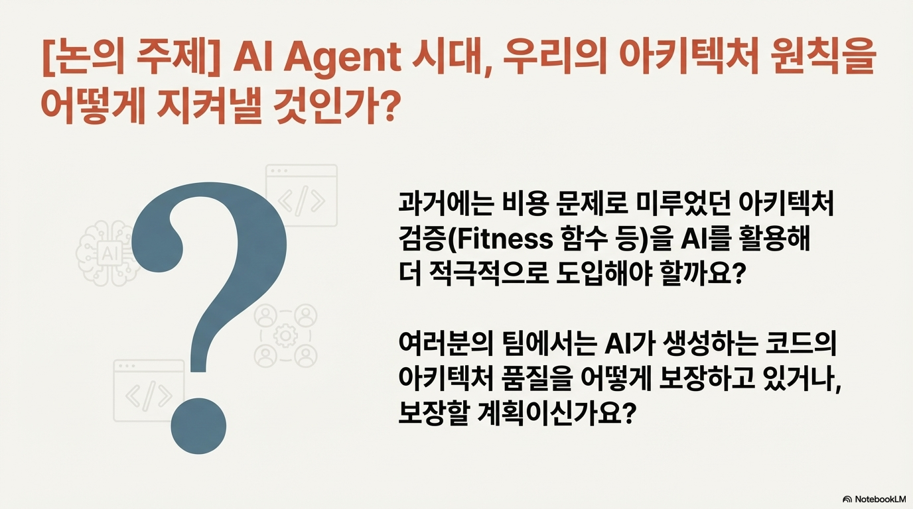

## 논의 주제
    - AI 시대에 1장에 나온 내용들을 어떻게 활용해볼 수 있을지 본인의 생각을 나눠보면 좋을 거 같다
        - 나의 답변
            - 개인적으로 Fitness 함수의 경우에 AI agent를 사용할 때, 제약사항으로써 제대로된 역할을 할 수 있을 것으로 기대한다
            - AI 시대가 되면서 한가지 변경되었다고 생각되는 것은 과거 사람의 러닝커브와 머리 용량의 한계로 할 수 없거나, 미루어졌던 일들을 AI를 활용해서 더 잘 한다고 판단되면 더이상 미룰 필요가 없다는 것이다. AI 의 단점 중 하나는 작성하는 코드를 예측하기 쉽지 않다는 점이고, SDD를 기반으로하는 바이브 코딩에서도 가장 중요한 것은 컨텍스트 관리를 통해 대량의 코드를 예측 가능하도록 agent를 관리하는 것인데, Fitness 함수는 Ai agent에게 아키텍쳐 특성에 관해서 객관적으로 체크해볼 수 있는 기준을 제시해주는 것이다. 이를 통해서, 의도한 아키텍쳐의 특성을 체크해볼 수 있다면, 도입하지 않을 이유가 없다고 생각한다

## 내용 요약
    - 개발 생태계는 전혀 예상치 못했던 방향으로 확장 진화 한다 그래서, 기술의 상세 구현 보다는 아키텍트가 어떤 의사결정을 내리는지 ,새로운 상황에서의 트레이드오프를 어떻게 객관적으로 평가할것인지에 집중
    - 새로운 문제에 직면했을 때의 트레이드오프 분석과 그에 따른 의사 결정이 가장 중요한 주제

## 내 의견
    - 책에서는 피트니스 함수 구현의 책임을 아키텍트로 보고 있는 것 같은데, 아키텍트로 꼭 제한할 필욘 없다고 생각
    - 피트니스 함수를 통해서, 일종의 단위테스트 처럼 빌드 타이밍에 체크해보는 방식이 예전에는 좀 번거로운 방식이라고 생각했었음 왜냐하면, 그냥 구조 자체를 문제없이 가져가면 되는건데, 꼭 테스트까지 만들어야하나? 라는 생각때문에, 하지만 지금은 AI를 통해서 쉽고 빠르게 작성할 수 있기 때문에 오히려 의도하는 바를 더 빡빡하게 표현함으로써, 사람도, AI도 실수 할 수 없게 만든다는 측면에서는 좋은 선택이라고 봄(이렇게 안하면, 매번 AI를 사용할 때, 컨텍스트에 해당 내용들을 명시를 해줘야만 하기 때문에)
    - 아키텍처 Fitness 함수는 아키텍쳐와 설계 레벨에서 약속한 정책(일종의 비기능적 요구사항)들을 체크해볼 수 있는 테스트로 볼 수 있고, 이를 배포 파이프라인에서 지속적으로 확인해봄으로써, 큰 효과를 거둘 수 있다
    - 1장에서는 크게 4가지를 말한다
        - 트레이드 오프
            - 각 상황마다 어떤 선택을 하느냐에 따라서, 트레이드 오프가 발생할 수 있다
            - 현 상황에서의 최고의 선택이 무엇일지 판단하여서, 선택하고, 그로인해 발생하는 트레이드 오프는 인지하고, 감수하여야한다
        - 아키텍처와 데이터의 관계
            - 아키텍쳐는 데이터에 영향을 받는다, 반대로 데이터 또한 아키텍쳐에 영향 받는다
        - ADR
            - 위의 트레이드 오프와 아키텍처, 데이터 까지 고려해서, 의사결정을 내릴 때, 그 의사결정에 대한 기록이 필요하다
            - 아키텍쳐 결정사항은 설계와 구현에 반영되는데, 설계와 구현의 의도를 제대로 알기위해서는 아키텍쳐 결정사항을 잘 문서화 해두어야 한다
        - Fitness 함수
            - 아키텍쳐 결정사항을 사람이 수동으로 체크하는게 아니라, 객관적으로 판단할 수 있는 방법을 제공해준다
