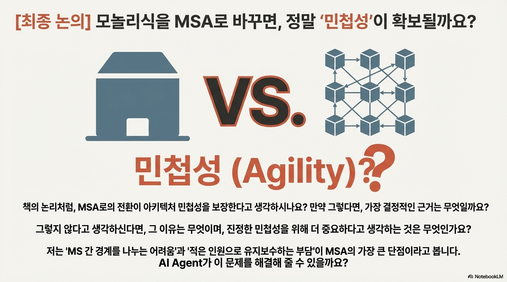

## 논의 주제
    - 책에서는 MSA를 통해서 모든 문제가 해결된다는 식으로 말하고 있진 않지만, 대체적으로 모놀리식은 문제있고, MSA는 이런 저런 장점이 있기 떄문에 문제 해결이 가능할거다 라는 식으로 논리를 전개하고 있습니다. 책에서 말한대로, 모놀리식을 MSA로 대체함으로써, 아키텍쳐 민첩성이 확보된다고 생각하시는지 궁금합니다 만약 그렇다면, 본인이 생각하는 근거가 무엇인지 얘기해보면 좋을거 같고, 그렇지 않다면, 그렇지 않다고 생각한 이유를 얘기해보면 좋을거 같습니다
    - 나의 답변
        - 제가 생각하는 MSA의 단점은 MS 간 경계를 나누는게 너무 어렵다는 것(사람마다 기준이 다르고, 상황마다 예전에는 맞았던게, 이후에는 틀린 경우도 생김)과 회사의 인원이 적을 때, 이렇게 나눠진 MS들의 유지보수 관리가 힘들다는 점 입니다. 하지만, AI Agent 들이 점차 발전하면서, 사람이 부족한 이부분을 해결해 줄 수 있지 않을까 기대하고 있습니다 최근에는 [컬리의 AI agent 활용 사례](https://helloworld.kurly.com/blog/oms-claude-ai-workflow/)도 있었고, 이런 식으로 AI Agent를 적극 활용하는 방식으로 인원 부족으로 인한 유지보수 문제는 해결할 수 있지 않을까 기대하고 있습니다 다른 분들의 의견이 궁금합니다

## 내용 요약
    - 모듈화 동인
        - 유지보수성
            - 얼마나 쉽게추가, 변경, 삭제할 수 있는지
        - 시험성
            - 테스트의 완전성, 회귀테스트 가능성
        - 배포성
            - 배포의 용이함
        - 확장성과 탄력성
            - 부하가 증가해도 시스템 응답성을 유지하는 능력
            - 높은 확장성과 탄력성이 필요하다면, 서비스 간 동기 통신을 가능한 적게 유지해야함
        - 가용성/내고장성
            - 특정 모듈에 문제가 생기더라도 서비스 전체에 영향이 가서는 안됨
            - 장애가 발생한 서비스에 동기적으로 의존하는 서비스가 있는 경우, 내고장성 달성이 힘듬

## 내 의견
    - 3장에서 팀이 직면한 문제는 모놀리식 아키텍쳐 구조가 급변하는 비즈니스 요구사항을 빠르게 충족하지 못한다는 것이다. 이에 해결책으로 제시하고 있는 것은 아키텍쳐 모듈화이다. 이를 통해서 아키텍쳐의 민첩성을 확보할 수 있게 되고, 그렇다면, 급변하는 비즈니스 요구사항에 대응이 가능하다는 논리이다.
    - 틀린말은 아니지만, 어떤 상황이냐에 따라서, 구체적인 how는 달라질 수 있을거 같고, 이 how를 어떻게 적용하는지가 사실상의 아키텍쳐 민첩성을 획득했느냐, 못했느냐의 차이로 이어질 것이라고 생각한다. (책에서 말한 내용은 너무 일반론적인 얘기라고 생각…)
    - 개인적인 경험상 아키텍쳐 민첩성을 위해서 가장 필요한 것은 유지보수성을 확보하는 것이라고 생각한다 왜냐하면, 유지보수성이 확보가 되지 않아서, 프로젝트 추가 기능 및 개선사항들이 빠르게 반영되지 못한 적을 경험해보았기 때문이다.
    - 추가로, 책에서는 MSA적용을 통해서, 기능 개발 시, 유지보수성에 도움이 됨을 어필하는데, 아주 성공적으로 MSA 경계가 잘 나눠진 상태에서, 다른 MS 와 아무 결합도가 없는 상태의 기능 개발에만 해당되는 얘기라는 말은 없어서 아쉬웠다. 실제로는 MSA 경계가 잘 나눠지지 않은 탓에, MS 간 결합도가 생겨서, 기능 개발에 더 시간이 올래 걸린 경험도 많았기 떄문이다
    - 시험성 부분에서 말하는 모놀리식에서 작은 수정에도 전체 테스트 케이스를 돌려야하는 문제는 어떤 관점에서는 문제가 맞지만, 프로젝트의 도메인별 모듈화를 잘 해둬서, 어떤 수정이 발생 했을 때, 영향도를 최소화 되도록 한다면, 충분히 모놀리식에서도 꼭 전체 테스트를 돌리지 않더라도, 회귀테스트를 효율적으로 진행 할 수 있다고 생각한다
        - 다만, MSA로 나눠지면서, 자연스럽게 코드가 격리되면서, 시험성이 보장되는 부분은 장점이라고도 볼 수 있다고 생각한다
    - 배포성 관련해서 모놀리식의 가장 큰 문제점은 책에서 말하는 배포주기 라기 보다는 배포했을 때, 기능 격리와 관련된 문제라고 생각한다. 배포주기는 모놀리식이라도 빈도는 얼마든지 늘릴 수 있다고 생각한다
    - 확장성, 탄력성 문제도 비슷한 맥락인데, 모놀리식에서도 충분히 대응할 수 있다고 생각하고, 회사 상황에 따라서, 결정은 언제든 달라질 수 있다고 생각한다 만약 우리 회사의 앞으로의 방향이 반드시 탄력성과 확장성을 보장해야만하는 이벤트들이 계속 있다면, 당연하게도 처음부터 확장성과 탄력성을 최대한으로 할 수 있는 아키텍쳐를 고려하는게 맞다 하지만, 가끔씩 있는 이벤트만 있는 상황이라면, 이 가끔있는 이벤트 한두번을 위해서 전체 아키텍쳐를 변경하는 것은 분명한 낭비라고 볼 수 있을거 같다 이런 경우는 기존 모놀리식 구조를 유지하면서, 이벤트 트래픽 처리를 위한 별도 인프라를 구성할 수도 있고, 혹은 스케일 업/아웃 으로 대응해보는 것을 고민해보는게 먼저라고 생각한다
    - 그리고  책에서도 나오지만, MSA를 하더라도, 특정 MS에 트래픽이 몰리게 될 때, 동기통신으로 통신하는 다른 MS들도 같이 트래픽 영향을 받게 되기 때문에 이부분에 대해서도 대용량 트래픽 대비를 위해서 설계를 하는 입장에서는 반드시 고려해야할 부분 이다
    - 가용성/내고장성의 경우에 확실히 MSA가 유리한게 맞지만, 이 또한 MSA 설계를 잘 못한다면, MSA의 장점을 살리지 못하고, 문제가 발생할 수 있다(책에 나온 동기통신 혹은 MSA 경계를 잘못나눴을 때)
    - 96page 의 ADR 문서는 책의 예제로 설명하기위해서, 어쩔 수 없이 개략적으로만 작성되었겠지만, 너무 개략적으로만 작성된 것 같다는 생각이 들었다
